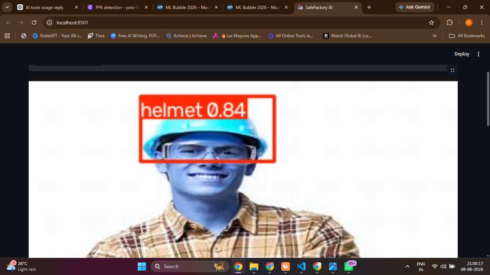
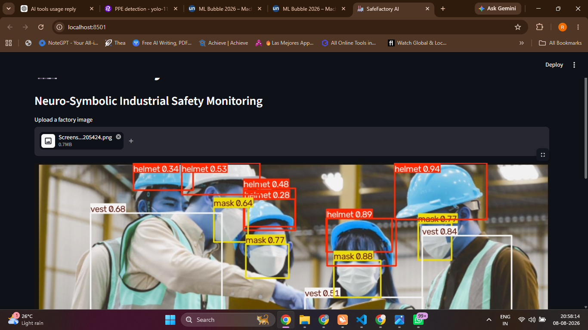

# 🏭 SafeFactory AI

### From Seeing Hazards to Reasoning About Safety.

**Explainable Neuro-Symbolic AI for Industrial Safety Monitoring**

> SafeFactory AI combines computer vision with symbolic safety reasoning to transform visual detections into explainable industrial safety decisions.

---

## 🚀 Overview

Traditional computer vision systems can detect objects, but object detection alone does not determine whether a situation is actually dangerous.

**SafeFactory AI** addresses this gap by combining:

**Visual Perception + Context + Symbolic Rules + Explainable Decisions**

The system uses a trained **YOLO11n** model to detect PPE-related objects such as:

- 🪖 Helmet
- 😷 Mask
- 🦺 Vest

These detections are combined with contextual safety conditions such as:

- 👷 Worker presence
- 🏭 Machine activity
- ⚠️ Hazard-zone status

A symbolic rule engine then evaluates the situation and generates:

**Risk Classification → Triggered Rule → Explanation → Recommended Action**

---

## 🧠 Why Neuro-Symbolic AI?

The core innovation of SafeFactory AI is not simply object detection.

### Neural AI — Perception

YOLO11n answers:

> **“What is visible?”**

It detects safety-related objects from an image.

### Symbolic AI — Reasoning

The rule engine answers:

> **“What does this situation mean for safety?”**

For example:

```text
Worker = YES
Machine = ACTIVE
Hazard Zone = YES
Vest = NO

        ↓

RULE-002

        ↓

HIGH SAFETY RISK
```

The system can then explain:

> Worker detected inside an active hazardous zone without the required safety vest.

### Core Principle

> **Neural networks perceive. Symbolic rules reason.**

---

# 🏗️ System Architecture

```text
                 FACTORY IMAGE
                       │
                       ▼
                ┌─────────────┐
                │   YOLO11n   │
                │  Perception │
                └──────┬──────┘
                       │
                       ▼
              PPE / Object Detection
                       │
                       ▼
             Structured Safety Facts
                       │
          ┌────────────┴────────────┐
          │                         │
          ▼                         ▼
    Machine Status             Hazard Zone
          │                         │
          └────────────┬────────────┘
                       ▼
              SYMBOLIC RULE ENGINE
                       │
                       ▼
              SAFETY CLASSIFICATION
                       │
             ┌─────────┴─────────┐
             ▼                   ▼
          SAFE              SAFETY RISK
                                 │
                                 ▼
                       EXPLANATION + ACTION
                                 │
                                 ▼
                       STREAMLIT DASHBOARD
```

---

# 📊 Dataset

### PPE Detection – YOLO-11

The project uses a versioned PPE object-detection dataset prepared/exported using Roboflow.

| Property | Details |
|---|---|
| Total Images | **650** |
| Training Images | **629** |
| Validation Images | **15** |
| Testing Images | **6** |
| Task | Object Detection |
| Classes | Helmet, Mask, Vest |
| Annotation | YOLO-compatible |

### Dataset Classes

- 🪖 Helmet
- 😷 Mask
- 🦺 Vest

> The full dataset is intentionally not included in this repository to keep the GitHub repository lightweight. Dataset details and reproducibility information are provided in the project documentation.

---

# 🤖 Machine Learning Model

### YOLO11n

SafeFactory AI uses a lightweight **YOLO11n** object detection model.

| Model Property | Value |
|---|---:|
| Architecture | YOLO11n |
| Parameters | **2,582,737** |
| GFLOPs | **6.4** |
| Training Epochs | **10** |
| Image Size | **640 × 640** |
| Framework | Ultralytics YOLO |
| Compute | CPU |

The model was trained locally using the YOLO-compatible PPE dataset.

---

# 📈 Model Performance

## Overall Validation Results

| Metric | Result |
|---|---:|
| **Precision** | **86.1%** |
| **Recall** | **79.0%** |
| **mAP@50** | **83.5%** |
| **mAP@50-95** | **52.0%** |

## Per-Class Performance

| Class | Precision | Recall | mAP@50 | mAP@50-95 |
|---|---:|---:|---:|---:|
| 🪖 Helmet | **94.0%** | **100.0%** | **97.6%** | 61.1% |
| 😷 Mask | **99.6%** | 71.4% | 76.1% | 46.9% |
| 🦺 Vest | 64.8% | 65.7% | 76.6% | 48.0% |

### Performance Interpretation

The helmet class achieved the strongest performance, reaching:

**97.6% mAP@50**

The model achieved very high precision for mask detection, while recall indicates that some instances were missed.

Vest detection is comparatively more challenging and represents an important area for future improvement.

> **Evaluation Note:** The current validation split contains only **15 images**. Therefore, these metrics demonstrate prototype feasibility rather than production readiness. Larger and more diverse industrial datasets are required for robust deployment validation.

---

# 🔣 Symbolic Safety Rules

SafeFactory AI uses explicit rules to convert detections and contextual information into safety decisions.

## RULE-001 — Critical PPE Violation

```text
IF

Worker detected
AND
Machine ACTIVE
AND
Hazard Zone ACTIVE
AND
Helmet Missing

THEN

CRITICAL SAFETY VIOLATION
```

### Recommended Action

> Stop the machine or remove the worker from the hazardous zone.

---

## RULE-002 — High Safety Risk

```text
IF

Worker detected
AND
Machine ACTIVE
AND
Hazard Zone ACTIVE
AND
Vest Missing

THEN

HIGH SAFETY RISK
```

### Recommended Action

> Remove the worker from the hazardous zone.

---

# 🖥️ Working Prototype

A functional **Streamlit dashboard** was implemented for interactive testing.

The application provides:

- 📷 Image upload
- 👷 Worker detection
- 🪖 Helmet detection
- 😷 Mask detection
- 🦺 Vest detection
- 🏭 Machine status
- ⚠️ Hazard-zone status
- 🚨 Safety classification
- 🔣 Triggered safety rule
- 🧠 Explanation
- 🛡️ Recommended action

---

# 📸 Prototype Results

## ✅ Safe Scenario

Five workers were detected with required PPE.

```text
Workers: 5
Helmet: Detected
Vest: Detected
Machine: ACTIVE
Hazard Zone: ACTIVE

RESULT:
No Critical Safety Violation
```



---

## ⚠️ Safety Violation Scenario

A worker was detected inside an active hazardous zone without the required safety vest.

```text
Workers: 1
Helmet: Detected
Vest: Missing
Machine: ACTIVE
Hazard Zone: ACTIVE

RESULT:
HIGH SAFETY RISK

RULE-002 Triggered
```



### Explanation

> Worker detected inside an active hazardous zone without the required safety vest.

### Recommended Action

> Remove worker from the hazardous zone.

---

# 🔄 End-to-End Workflow

```text
1. Upload Factory Image
          ↓
2. YOLO11n Inference
          ↓
3. Detect PPE
          ↓
4. Extract Structured Facts
          ↓
5. Add Safety Context
          ↓
6. Evaluate Symbolic Rules
          ↓
7. Classify Risk
          ↓
8. Generate Explanation
          ↓
9. Recommend Safety Action
```

---

# 🛠️ Technology Stack

| Category | Technology |
|---|---|
| Language | Python |
| Computer Vision | OpenCV |
| Object Detection | Ultralytics YOLO11n |
| Image Processing | Pillow |
| Interface | Streamlit |
| Dataset Management | Roboflow |
| Reasoning | Symbolic Rule Engine |
| Development | VS Code |

---

# 📁 Project Structure

```text
SafeFactory-AI/
│
├── app.py
├── safety_engine.py
├── requirements.txt
├── README.md
├── .gitignore
│
├── screenshots/
│   ├── safe_scenario.png
│   └── violation_scenario.png
│
└── docs/
    └── SafeFactory_AI_Project_Documentation.pdf
```

---

# 🧩 Key Engineering Components

### `app.py`

Contains the Streamlit interface, model inference and safety-monitoring workflow.

### `safety_engine.py`

Contains the symbolic safety reasoning logic and rule evaluation.

### `requirements.txt`

Contains the Python dependencies required to reproduce the environment.

### `screenshots/`

Contains actual prototype demonstration results.

### `docs/`

Contains the complete technical project documentation.

---

# 🔍 Explainability

Instead of producing only:

```text
Risk Detected
```

SafeFactory AI provides a traceable reasoning chain:

```text
WHAT?

Worker + Missing Vest

        ↓

CONTEXT?

Machine Active + Hazard Zone

        ↓

WHICH RULE?

RULE-002

        ↓

SEVERITY?

HIGH SAFETY RISK

        ↓

WHY?

Required safety vest was not detected.

        ↓

ACTION?

Remove worker from hazardous zone.
```

This makes the system easier to understand, audit and extend.

---

# 💡 Key Differentiators

### Traditional Object Detection

```text
Image
 ↓
Object
 ↓
Label
```

### SafeFactory AI

```text
Image
 ↓
Visual Perception
 ↓
Safety Facts
 ↓
Context
 ↓
Symbolic Rules
 ↓
Risk Classification
 ↓
Explanation
 ↓
Recommended Action
```

### The Core Difference

> **SafeFactory AI moves from “What do I see?” to “What does what I see mean for safety?”**

---

# ⚠️ Current Limitations

The current prototype has several limitations:

1. The system currently processes uploaded images rather than live CCTV streams.
2. Machine activity and hazard-zone status are currently provided as structured inputs.
3. The validation split contains only 15 images.
4. The current dataset focuses on helmet, mask and vest detection.
5. The system has not been deployed in a real industrial environment.
6. No direct machinery control is implemented.
7. Larger-scale evaluation is required before safety-critical deployment.

> SafeFactory AI is a research/demo prototype and should not be used as an autonomous industrial control system.

---

# 🚀 Future Scope

## Phase 1 — Real-Time Monitoring

- Live CCTV/video processing
- Continuous PPE monitoring
- Real-time safety alerts

## Phase 2 — Advanced Perception

- Dedicated hazardous-zone detection
- Machine detection
- Worker-machine proximity analysis
- Additional PPE categories

## Phase 3 — IoT Integration

Potential sensor inputs:

- Temperature
- Machine state
- Proximity
- Environmental conditions

## Phase 4 — Industrial Deployment

- Multi-camera monitoring
- Edge inference
- Control-room dashboard
- Automated notifications

## Phase 5 — Safety Analytics

- Historical violations
- Risk trends
- Incident analytics
- Safety compliance reports

---

# 🔐 Safety & Ethical Considerations

Because industrial safety is a high-impact application, SafeFactory AI is designed with human oversight in mind.

Important considerations include:

- Human review of safety decisions
- Privacy-aware camera deployment
- Explicit and auditable rules
- No autonomous machinery control
- Transparent model limitations
- Continuous performance monitoring
- Extensive validation before real-world deployment

---

# 📚 Reproducibility

To reproduce the prototype:

```text
1. Create a Python virtual environment
2. Install dependencies
3. Obtain the versioned PPE dataset
4. Train YOLO11n for 10 epochs
5. Validate the trained checkpoint
6. Launch the Streamlit application
7. Upload a test image
8. Review PPE detections
9. Provide contextual safety conditions
10. Observe the symbolic safety decision
```

The trained checkpoint generated during development was:

```text
runs/detect/train/weights/best.pt
```

The trained model artifact is not committed to this repository to keep the repository lightweight.

---

# 📊 Project Snapshot

| Component | Status |
|---|---|
| PPE Dataset | ✅ |
| YOLO11n Training | ✅ |
| PPE Detection | ✅ |
| Model Evaluation | ✅ |
| Symbolic Rule Engine | ✅ |
| Explainable Alerts | ✅ |
| Streamlit Prototype | ✅ |
| Safety Scenarios | ✅ |
| Documentation | ✅ |
| GitHub Repository | ✅ |

---

# 🎯 Final Takeaway

SafeFactory AI demonstrates how **Computer Vision + Symbolic Reasoning + Explainable AI** can be combined to create a more meaningful industrial safety monitoring system.

The project does not stop at detecting:

> **“There is a worker.”**

It attempts to answer:

> **“What is happening, why is it unsafe, which rule was violated, and what should happen next?”**

---

## 👩‍💻 Author

### Rimjhim Rani

**SafeFactory AI**

*From Seeing Hazards to Reasoning About Safety.*

**ML Bubble 2026 — Army Institute of Technology, Pune**